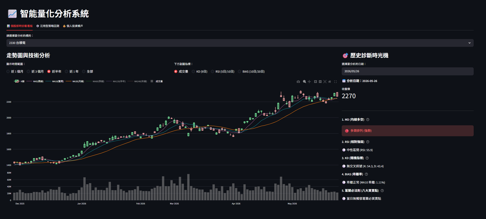

# 期末專題: 股票分析

## 新增功能: 鴻海法人策略研究

本分支新增一個獨立頁籤「鴻海法人策略研究」，主體看板與原本泛用回測不大改。

研究內容：

- 固定標的：2317 鴻海
- 法人資料：TWSE 三大法人買賣超日報 T86
- 技術指標：葛蘭碧八大法則、BB、MACD、KDJ
- 回測比較：
  - Buy & Hold
  - 純葛蘭碧
  - 葛蘭碧 + 外資週淨買超
  - 葛蘭碧 + BB
  - 葛蘭碧 + MACD
  - 葛蘭碧 + KDJ

法人資料可在「鴻海法人策略研究」頁籤內用「更新鴻海三大法人資料」按鈕寫入資料庫。
回測採用「當日收盤產生訊號，下一個交易日開盤成交」，避免同日訊號同日成交造成的未來函數問題。

##  啟動步驟 
1. 設定一下 `.env`檔案的DB密碼隨便打就好

    如果本機 SQL Server / ODBC 連線一直出問題，可以先用 SQLite 模式：

    ```env
    DB_DRIVER=sqlite
    DB_SQLITE_PATH=db_final.sqlite3
    ```
 
2.
    ```bash
    docker compose up -d
    ```
3. 連線到 `http://localhost:8080/`建立DB(`.env`裡面的名稱) 然後把`indicator.sql`複製進去執行
4. 
    ```bash
    pip install -r requirements.txt
    ```
5. 
    啟動之後等他抓完資料會需要幾分鐘
    ```bash
    python -u main.py
    ```
6. 把服務跑起來
    ```bash
    streamlit run app.py
    ```
這樣應該就能看到畫面了


## 需求套件

`requirements.txt` 只保留專案直接使用的套件。若安裝時遇到 SQL Server 連線問題，請確認本機已安裝 ODBC Driver 18 for SQL Server。

